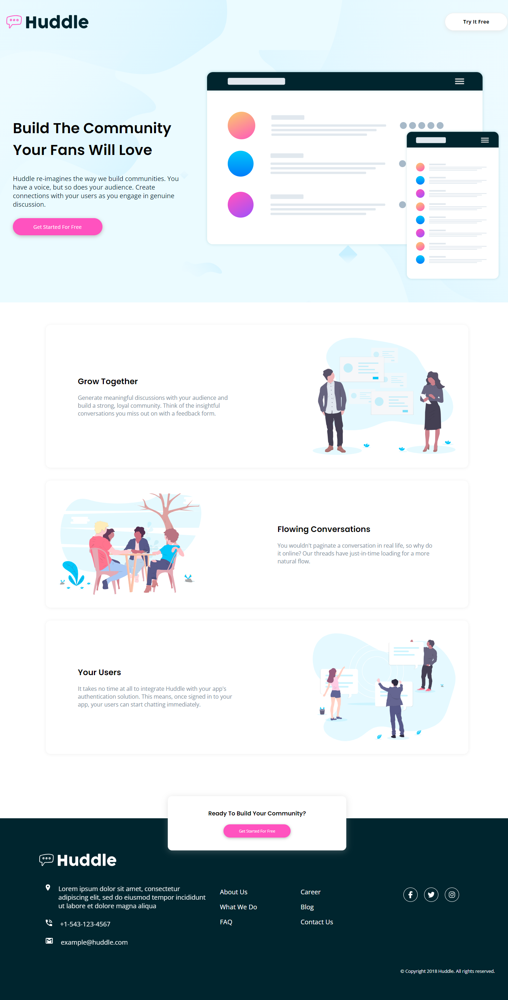

# Frontend Mentor - Huddle landing page with alternating feature blocks solution

This is a solution to the [Huddle landing page with alternating feature blocks challenge on Frontend Mentor](https://www.frontendmentor.io/challenges/huddle-landing-page-with-alternating-feature-blocks-5ca5f5981e82137ec91a5100). Frontend Mentor challenges help you improve your coding skills by building realistic projects.

## Table of contents

- [Overview](#overview)
  - [The challenge](#the-challenge)
  - [Screenshot](#screenshot)
  - [Links](#links)
- [My process](#my-process)
  - [Built with](#built-with)
  - [What I learned](#what-i-learned)
  - [Continued development](#continued-development)
  - [Useful resources](#useful-resources)
- [Author](#author)
- [Acknowledgments](#acknowledgments)

**Note: Delete this note and update the table of contents based on what sections you keep.**

## Overview

### The challenge

Users should be able to:

- View the optimal layout for the site depending on their device's screen size
- See hover states for all interactive elements on the page

### Screenshot



### Links

- Solution URL: [Github Repository](https://github.com/DavidFayemi/Huddle-landing-page-with-alternating-feature-blocks)
- Live Site URL: [Github Pages](https://davidfayemi.github.io/Huddle-landing-page-with-alternating-feature-blocks/)

## My process

- Update the .gitignore to remove the design folder
- Arranged My Project Folder
- Downloaded Fonts and added them to the Fots folder in assets
- Started with structuring the HTML
- Added Classes using CSS BEM naming standard
- Styled The Mobile design
- Styled the Tablet Design
- Styled The Desktop Design

### Built with

- Semantic HTML5 markup
- CSS custom properties
- Flexbox
- CSS Grid
- Mobile-first workflow
- CSS BEM

### What I learned

- I understood the CSS BEM a lot better
- I've gotten very confortable with using CSS grid

```html
<section class="sectionA">
  <div class="sectionA--main">
    <header class="sectionA--header">
      Build The Community Your Fans Will Love
    </header>

    <p class="sectionA--paragraph">
      Huddle re-imagines the way we build communities. You have a voice, but so
      does your audience. Create connections with your users as you engage in
      genuine discussion.
    </p>

    <button class="get-started-button">Get Started For Free</button>
  </div>
  <div class="sectionA--illustration">
    
  </div>
</section>
```

```css
:root {
  --Pink: hsl(322, 100%, 66%);
  --Pink-hover: hsl(322, 100%, 76%);
  --Very-Pale-Cyan: hsl(193, 100%, 96%);
  --Very-Dark-Cyan: hsl(192, 100%, 9%);
  --Grayish-Blue: hsl(208, 11%, 55%);
}
```

### Continued development

Responsive web design, css BEM and css Grid

## Author

- Frontend Mentor - [@yourusername](https://www.frontendmentor.io/profile/DavidFayemi)

## Acknowledgments

All Glory to God
